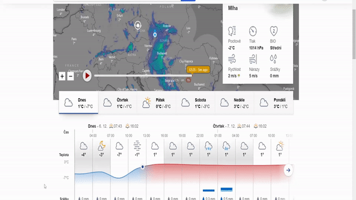

# Aplikace pro předpověď počasí

## Úvod

Vítejte v dokumentaci k aplikaci pro předpověď počasí! Tato fiktivní aplikace vám umožní získat aktuální informace o počasí na základě různých meteorologických zdrojů.

## Instalace

Pro nainstalování aplikace pro předpověď počasí postupujte podle následujících kroků:

1. Naklonujte repozitář na svůj počítač:
    ```bash
    git clone https://github.com/kubicek_daniel/fiktivni_pocasi_predpoved.git
    ```

2. Přejděte do složky s projektem:
    ```bash
    cd pocasi_predpoved
    ```

3. Nainstalujte potřebné knihovny pomocí příkazu:
    ```bash
    pip install -r requirements.txt
    ```

4. Konfigurujte aplikaci a nastavte API klíče pro meteorologické služby.

## Jak používat

Po úspěšné instalaci můžete aplikaci spustit a využívat následující základní funkce:

1. **Získání aktuální předpovědi:**
    - Otevřete aplikaci.
    - Vyberte lokalitu nebo zadejte souřadnice.
    - Stiskněte tlačítko "Získat předpověď".
  
2. **Vyhledávání podrobných informací:**
    - Klikněte na konkrétní den v předpovědi.
    - Zobrazí se detailní informace o počasí v daný den.



## Licence

Tato aplikace pro předpověď počasí je dostupná pod licencí [MIT](https://choosealicense.com/licenses/mit/#). Pro detaily si přečtěte plný text licence.

## Licence projektu

Licence projektu se nachází v souboru LICENSE ve složce projektu.

